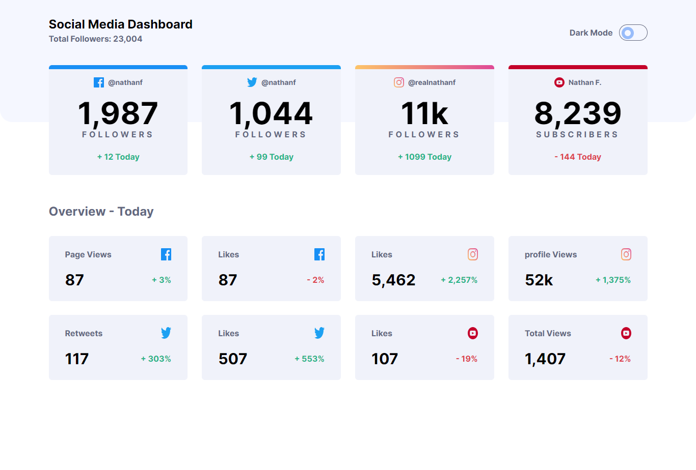
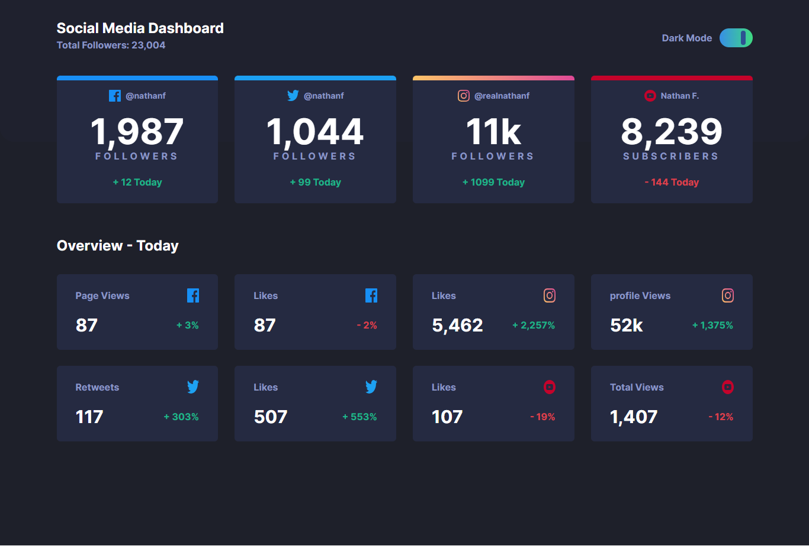

# Social Media Dashboard

Esta es una solución al [Social media dashboard with theme switcher challenge on Frontend Mentor](https://www.frontendmentor.io/challenges/social-media-dashboard-with-theme-switcher-6oY8ozp_H). Los retos de Frontend Mentor te ayudan a mejorar tus habilidades de programación construyendo proyectos realistas.

## Tabla de contenido

-   [Overview](#overview)
    -   [The challenge](#the-challenge)
    -   [Screenshot](#screenshot)
    -   [Links](#links)
-   [Author](#author)

## Overview

### The challenge

Los usuarios deben poder:

-   Ver el diseño óptimo del sitio en función del tamaño de pantalla de su dispositivo.
-   Ver los estados hover de todos los elementos interactivos de la página.
-   Cambiar el tema de color según sus preferencias

### Screenshot

### Links

- URL del sitio web: [Add live site URL here](https://your-live-site-url.com)

### Construido con

- Semantic HTML5 markup
- CSS custom properties
- Flexbox
- CSS Grid
- Mobile-first workflow
- [Tailwind ](https://tailwindcss.com/) - CSS framework

## Author

-   LinkedIn - [Daniel Rodado](https://www.linkedin.com/in/daniel-rodado-b24432210/)
